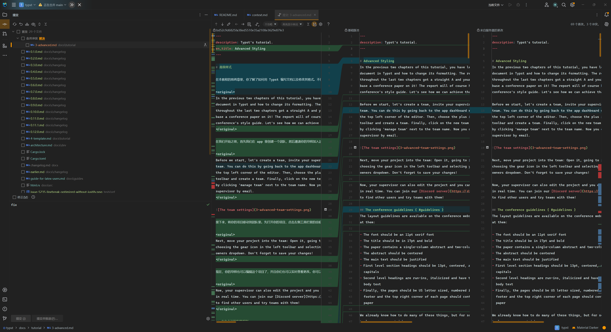
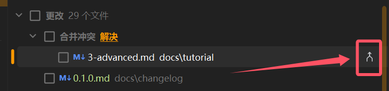
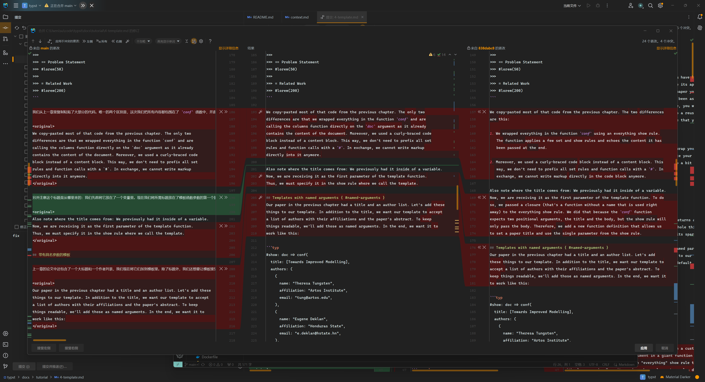
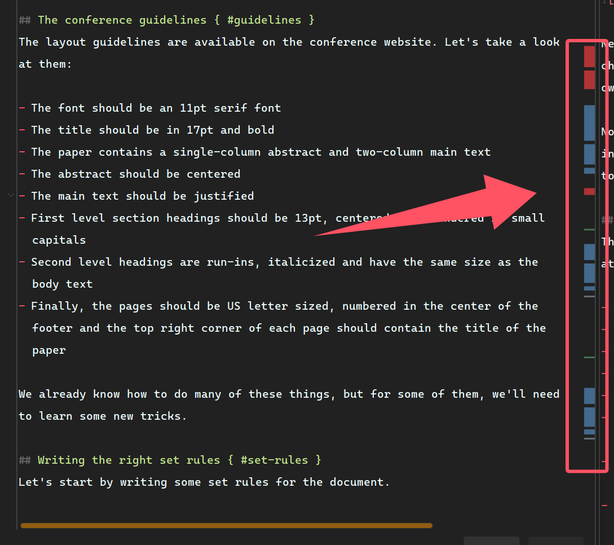

<h1>Typst <em>translated.</em></h1>

这里是 typstdocsinchinese 非官方中文文档项目的翻译仓库。

考虑到 Typst 文档与项目本身的高度关联性，这里保留了原 Typst 仓库的全部内容，并在此基础上进行各种更改。

## 翻译流程

建议本地进行翻译，配合 Visual Studio Code 或者任意 IntelliJ 系列的 IDE 进行（更推荐后者）。

1. clone 本项目
  ```shell
  git clone https://github.com/typstdocsinchinese/typst.git
  ```
2. 开始翻译。请打开 `docs` 文件夹，选择你要翻译的 Markdown 文件（以 `.md` 结尾），开始翻译。翻译时，请参考[翻译指引](./TRANSLATION-GUIDE.md)来避免提交的内容有误或者不符合标准
  - `docs/changelog` 中的内容**不在**翻译计划内，请不要翻译
  - 关于哪些文件对应哪些页面，请参考[网页](https://github.com/typstdocsinchinese/typstdocsinchinese.github.io)，注意观察页面的 URL
  - `docs/reference/groups.yml` 中的内容较特殊，如果你熟悉 Yaml 语法，可考虑进行翻译
  - 文档的有些页面来自于 Rust 代码中的注释，因此也需要进行翻译，如果你感兴趣，可打开 `crates` 文件夹，选择相应的包，打开 `.rs` 源文件开始翻译
3. 通过 git，提交翻译到本仓库中，或者从你的 fork 提交 Pull Request
4. 等待 3-5 分钟即可在[网页](https://github.com/typstdocsinchinese/typstdocsinchinese.github.io)上看到你的修改

## 合并 upstream 流程

当 Typst 上游发生更新时，
- 如果更新内容与现有修改内容不冲突，则使用 GitHub 自带的 fetch upstream 功能，不定期进行同步。
- 如果更新内容与现有内容存在冲突，则利用本地 git 和 IDE 进行手动 merge **以及** 对应的新内容的翻译更新，然后以一个 merge commit 的形式提交到本仓库。

手动 merge 也是翻译工作的一部分，因为这涉及到了对更新内容的重新翻译。可按照下面的步骤进行一次 merge。merge 不需要每天都进行，但应当至少一个星期进行一次（视上游更新频率而定）。在遵循步骤进行之前，请准备

- git
- IntelliJ 系列任意 IDE（具有 VCS 功能即可）

> [!CAUTION]
> 下面的步骤，尤其是执行了 `git merge` 之后的一系列步骤，一经开始就必须进行下去，直到完成。否则，随着时间的推移，未完成的 merge 将逐渐变得无效或者复杂。而且完成之前不宜对项目文件进行大范围的修改。
>
> 因此，请在准备好进行 merge 工作之后再开始。

### 本地 git 同步上游仓库

在你 clone 了本项目的情况下，假设指向本项目的远程仓库别名为 origin，`git remote -v` 的结果应当是

```
origin  git@github.com:typstdocsinchinese/typst.git (fetch)
origin  git@github.com:typstdocsinchinese/typst.git (push)
```

或者

```
origin  https://github.com/typstdocsinchinese/typst.git (fetch)
origin  https://github.com/typstdocsinchinese/typst.git (push)
```

如果要同步上游仓库，需要先添加上游远端仓库，在这里以 upstream 为别名。

```shell
git remote add upstream https://github.com/typst/typst.git
```

此时 `git remote -v` 结果类似于

```
origin  git@github.com:typstdocsinchinese/typst.git (fetch)
origin  git@github.com:typstdocsinchinese/typst.git (push)
upstream        https://github.com/typst/typst.git (fetch)
upstream        https://github.com/typst/typst.git (push)
```

> [!NOTE]
> 以上内容只需要设置一次，之后只需要重复下面的步骤即可。

然后执行

```shell
git fetch upstream
```

同步远端仓库内容。然后执行

```shell
# 假设此时已经处于本地 main 分支下
# 如果没有，请先执行 git checkout main
git merge upstream/main
```

这是就进行了一次 merge 的尝试，大概率会出现冲突。请打开 IDE 继续合并的相关操作。

### 示例：使用 IntelliJ 系列 IDE 进行 merge

打开任意一个 IntelliJ 系列的 IDE，此处以 WebStorm 为例。添加你 clone 的 typstdocsinchinese/typst 项目，打开，然后选择左上角第二个图标（在文件管理的下边），打开 VCS 面板。下图是 IDE 中打开的 VCS 板块示例：



由于上面进行了 `git merge`，此时在 VCS 面板中应该已经有相关冲突的提示，找到“合并冲突”下面的文件，这些是我们需要处理的对象。点击右侧的分支箭头标志，打开合并面板。



> [!WARNING]
> 不要点击“解决”，也不要直接勾选提交，因为这是一个需要解决的问题。请点击上图红框内的按钮进行下面的步骤。

打开后会出现这样的窗口：



合并面板的左侧是我们本地当前版本的内容，右侧则是来自远端仓库——Typst 官方更新的版本，中间是我们的操作空间，也是最终的结果。我们将选择性地从左右侧挑选内容到中间，或者放弃部分内容，并辅以我们的手动编辑，最终得到一个**合理**的结果。注意，中间的部分是可以编辑的，两边均不可编辑只作为参考。



如上图所示，你会发现存在四种颜色的块：灰色、红色、蓝色和绿色。其中灰色、蓝色、绿色一般不需要过于注意，直接照搬即可，而红色则是冲突的部分，需要我们手动进行操作，这包括
- 翻译右侧出现的新内容
- 舍弃左侧过时而不适合保留的内容
- 照搬左侧与右侧相同的内容
- ...

要保留一个部分的内容，请点击 `>>` 或者 `<<` 形状的按钮。要舍弃一部分内容，请点击 `X` 按钮。另外，这个页面是支持 Ctrl+Z 撤销的。

当所有的色块都消失的时候（也就是你对所有的色块都进行了保留和舍弃之间的选择）代表合并结束，此时顶部会有一行字提示你已经合并完成，点击右下角的“应用”完成这次合并。``

重复以上操作，直到“合并冲突”内没有项目为止，然后提交此次更改，push 即可完成一次 merge 工作。

### 示例：使用 Visual Studio Code 进行 merge

*欢迎补充*

## 自动化流程

> [!NOTE]
> 参见
> - 本项目的流程 - [rust.yml](https://github.com/typstdocsinchinese/typst/blob/main/.github/workflows/rust.yml)
> - 前端的流程 - [webpack.yml](https://github.com/typstdocsinchinese/typstdocsinchinese.github.io/blob/main/.github/workflows/webpack.yml)

当接收到 push 时，将会构建最新的 `typst-docs` package 并用其生成文档的数据，包括 assets 和 JSON 数据文件，随后将其上传到 [typstdocsinchinese.github.io](https://github.com/typstdocsinchinese/typstdocsinchinese.github.io) 项目（以下简称前端）的相关位置。

当前端 repo 接收到 push 时，会根据现有的数据和代码执行 `npm run generate` 构建静态文件，并将生成的站点内容更新到 public branch 里，也就是 GitHub Pages 所 serve 的 branch。随后网页上的内容就会更新。

整个流程大致耗时五分钟左右。因此，当你在本项目中进行了翻译上的修改后，静候五分钟即可在网站上看到更新后的内容。偶尔会存在缓存，可用 Ctrl+Shift+R（chrome）硬性刷新。


